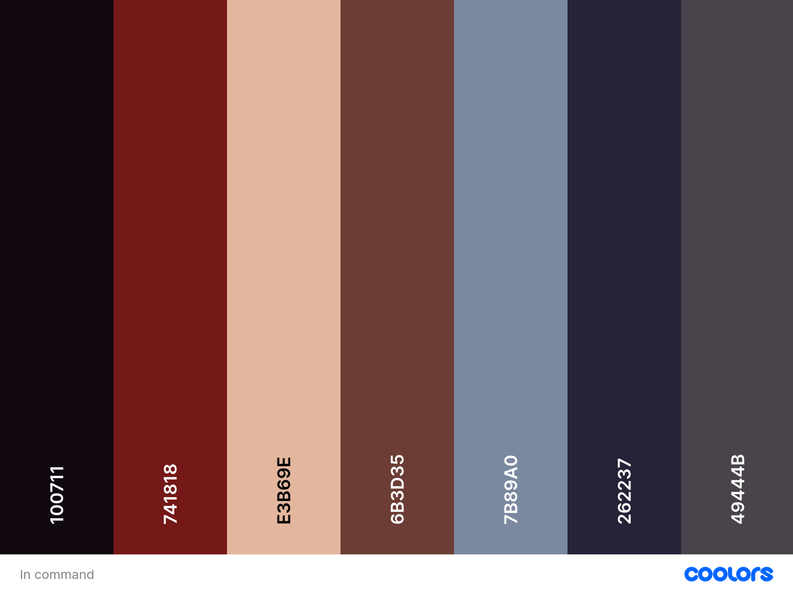
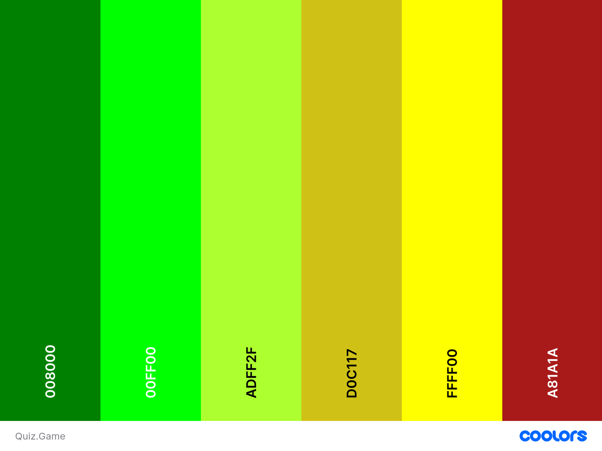
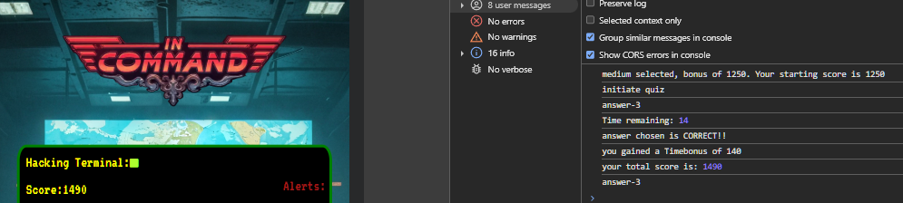
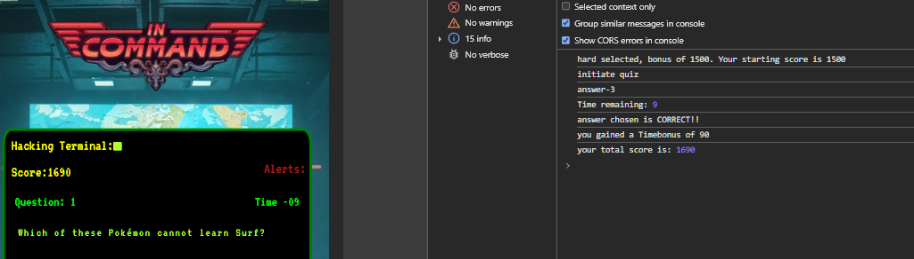
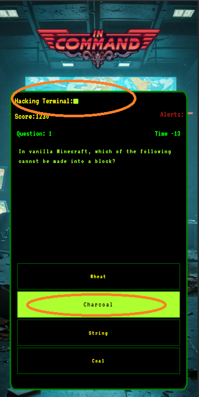
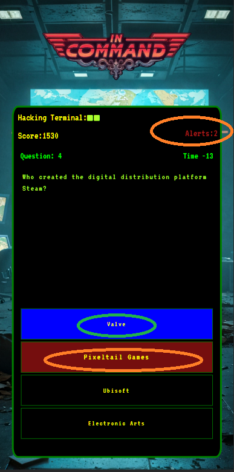
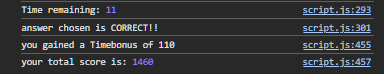
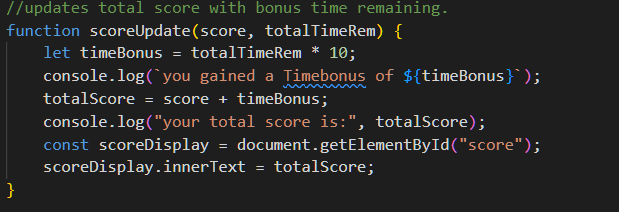
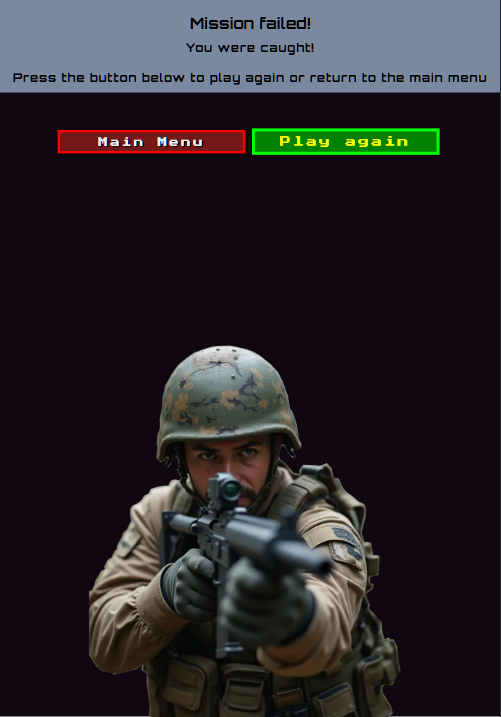

# In command website / game

In command is a fast paced quiz game designed for a range of devices. The aim of the game is to complete the quiz as quick as possible whilst also not triggering the alarm and alerting the enemy to your presence.

[View on GitHub Pages](https://nchrist89.github.io/In-Command/)

## Introduction

 

In command has been the second website and first game I have created using Javascript. I had so much fun in building it and have learnt so much from this project and about my love for Javascript. The end result of the project isn't exactly what I had originally planned but it's turned out even better after a decision mid-way to change the feel of the project. Originally it felt very dull and I wanted it to give it a livelier feel, so I added an 80's style Bladerunner vibe to it. It would also work with the idea that I originally planned. The outcome I am extremely happy with.

The logo and all images were all designed by AI with prompts which took quite a long time to get just right. They were also edited by me. The only thing I have not solely created was the soundtrack. The soundtrack was from a youtube video of an old sega game soundtrack. I had to rip the soundtrack from the video using Audacity software.

I have given the link to many family and friends, all of which have enjoyed the game quite a lot and expressed their frustration at the difficulty but also the want to succeed and be victorious meaning it has been quite addictive and given the game some replayability. This has kept quite a few of them entertained whilst letting me know of any issues.

I was let down at the end when I realized that in order to make an actual functioning leaderboard. I would need to create a server which could store the scores. Unfortunately, I have had to settle with a local storage leaderboard. Other than that, I am happy with it. I will look forward to improve and add to it in the future.

The game itself is the user hacking the computer and the hacking part is substituted with a quiz which in a way is the difficulty in the hacking of the computer. I done it this way to enable me to have a reason for the quiz failure and different victory outcomes. This allowed me to create a basis for the story behind it.

## CONTENTS

- [In command website / game](#in-command-website--game)
  - [Introduction](#introduction)
  - [CONTENTS](#contents)
  - [User Experience (UX)](#user-experience-ux)
    - [User Stories](#user-stories)
  - [Design](#design)
    - [Colour Scheme](#colour-scheme)
    - [Typography](#typography)
    - [Imagery](#imagery)
    - [Wireframes](#wireframes)
    - [Features](#features)
    - [Sections / screens (In place of pages)](#sections--screens-in-place-of-pages)
    - [Accessibility](#accessibility)
  - [Technologies Used](#technologies-used)
    - [Languages Used](#languages-used)
    - [Frameworks, Libraries \& Programs Used](#frameworks-libraries--programs-used)
  - [Deployment and local development](#deployment-and-local-development)
    - [Deployment](#deployment)
    - [Local Development](#local-development)
      - [How to Fork](#how-to-fork)
      - [How to Clone](#how-to-clone)
  - [Testing](#testing)
  - [Solved Bugs](#solved-bugs)
  - [Known bugs](#known-bugs)
  - [Testing User Stories](#testing-user-stories)
  - [Credits](#credits)
    - [Code used](#code-used)
    - [Content](#content)
    - [Media](#media)
      - [Images](#images)
    - [Acknowledgements](#acknowledgements)

## User Experience (UX)

**Initial Planning**

When deciding what I wanted to build for my second project, I had a lot of wild idea's running around in my head. Upon looking at how I would create these idea's using Javascript, I quickly understood just how difficult they would all be. After looking at various idea's others had gone with, I decided that a quiz could enable me to go with the original idea I had planned but not in the way I had originally planned it. I felt I could make the quiz more interesting and build upon a standard quiz. There is a reason to build up correct answers and a question timer to have tension which after brainstorming for many hours, I had come up with the idea behind 'In Command!'.

After running the idea past my father he suggested the name In command and this was a great Idea because the game was taking place on an old style computer (terminal) and would look like it was written in command prompt. Secondly you are a secret agent needing to take command of the computer and as the player you have the end result of taking command on the leaderboard. So there it was, In Command stuck as the name.

**Key information for the site**

* Allows the user to use a range of devices from small mobile landscape to large mobile landscape. tablet, laptop, computer and large monitors.

* Allow the user to select game difficulty between 3 option which are easy, medium and hard.

* The game has two ways of completing the objection which are to answer 10 questions correctly or making it to the 15th question without 5 alerts triggering a failure.

* Should the user fail they can replay the game on the failure page replaying with the original difficulty chosen otherwise they can return to the title screen (home).

* Completing the game allows the user to input their name to store their name in local storage on the leaderboard.

### User Stories

**Client Goals**

* To provide an interesting way of adapting a quiz into a replayable game, which will be exciting and fun to the user and engage them to replay.

* To provide multiple ways to succeed at the game.

**First Time Visitor Goals**

As a player looking for fun and replayability - *I would like to enjoy a quiz that provides a need to want to get a better score and pulls me back to want to replay the game.*

As a novice player - *I would like to start with the easy difficulty option where I can build my confidence and then gradually work my way up the difficulty levels without feeling overwhelmed.*

As a player looking for feedback - *I would like to see visual feedback on wether or not I got a question right or wrong. so I can learn from it and improve upon my knowledge next time.*

As a player interested in progress of completion - *I would like to be provided visual knowledge of my correct and incorrect guesses so I am kept aware of my progress within the game.*

**Returning visitor goals**

As a competitive player - *I would like to complete the quiz as quickly as possible while answering the questions correctly, so I can improve upon my score and climb the leaderboard.*

As a player who prefers challenges - *I want to have consequences for questions which I get incorrect so that I feel the thrill of the challenge and I am encouraged to improve the next time.*

As a strategic player - *I want multiple paths to victory so I can replay the game attempting to complete with a new challenge.*

## Design

I had a lot of fun with the design on the project. The images took much more time than you would expect but it's difficult explaining to AI what I wanted. The images were edited in many different ways and input into the project how they are.

### Colour Scheme

I have separated the colours used to the colours which mostly make up the quiz game face itself and the colours which are used over the project.

The below colours are what make up the background colors and box borders, text background and text, menu buttons.

The colours below make up the quiz game colours which are designed to feel bright and catch attention onscreen where the focus of the main quiz game. These colours also make up the replay game buttons.

### Typography

Google Fonts has been used for the following fonts:

Orbitron has been used as the main primary font which is used for all the main text on the website. When I designed the logo I realized the original font wasn't going to be suitable and I came across Orbitron, it matches the style of a futuristic blade-runner style font which would suit the feel I was looking for.

Press Start 2P was the original font I had gone with for the quiz game but after using it for a while I realized the font size was too big and clunky to be within the quiz game and therefore I decided I would still use it but for the game buttons apart from the return to menu button.

After realizing I was unable to use Press start 2P as the quiz game font I had to look for another font which would suit the style of the game but also be readable without causing too much frustration having to read and VT323 out of several fonts made the cut to be the font I went with.

### Imagery

All images on the homepage of the website have been generated using [Prome AI](https://www.promeai.pro/ai-image-generation) website. All images are owned by myself and have been edited within Gimp(Image manipulation software) to produce their final version used.

### Wireframes

Wireframes was used to create the initial design of the quiz. I wanted for it to be simple and allow me to adapt it to anything I create around it.

The title page has changed from the mock up wireframe. I originally wanted for their to be a lights off mode but I didn't end up going with it in the end.

The game screen almost remains the same as what I had intended.

The leaderboard screen has changed but I was unable to get the edited image I created to work with the scoreboard and adapting it responsively was causing many problems so I had to simplify it.

### Features

* The website / game all runs using Javascript and uses one HTML page which combines all the sections of the game into different screens which are available to the user when they need.

* The main title page which is where the user opens up to is available to get to at all screens, this can be from the 'In Command' logo on screen or the main menu buttons available should the logo be unavailable on screen such as the failure screen.

* The user has the ability to view the scoreboard from the main title page. It opens up giving the user a look at the scoreboard and automatically closes after a short period of time.

* The entire game uses the entire viewport to display and therefore there is no navigation bar and no footer.

* The user has 3 difficulty options to choose from, each giving them a higher starting bonus score.

### Sections / screens (In place of pages)

  The website / game has several sections (screens) which are -

* Title screen (main home page) is what first welcomes the user.
  * I am really happy with how this turned out. I put a lot of effort into making it right. The buttons are not ideal and the colours I wanted were not accessibility friendly so I have had to change them last minute.

  

* Difficulty selection screen which opens when the user selects the play option.
  * This is a basic difficulty selection screen. The button colour is not idea but I had them match the title screen.

  

* Game screen which opens after difficulty is selected.
  * The game screen was originally planned to have a background video play and the quiz game was displayed on an old computer monitor but this caused much frustration and would not have been ideal for user experience and therefore it was scrapped. The final outcome is much better, brighter and cleaner.

  

* Failure screen which appears when the alerts counter reaches 5.
  * I originally had the guard pop-up on screen over the top of the quiz game but mid way through the project this then became part of the failure screen.

  

* Victory screen which appears should the user complete the 15 questions or answer 10 correctly without failing.
  * The victory screen I decided on was a picture of a nuclear missile ready to be fired. A text box appears which shows you your final total score.

  

* Leaderboard screen which can be accessed through the main title screen (home) or by completing the game after the victory screen.
  * The leaderboard screen I decided not to put to much time into seeing as I would only be able to make it available for local storage scores. In the future updates I will make a proper leaderboard which can store the scores on an SQL server which I look to learn and implement into this project in the coming months.

  

* How to play modal which is not a screen but should be included here as an option.

  

### Accessibility

I have throughout the project ensured that the website has been accessibility friendly. This has been achieved by:

* Using semantic HTML
* Using descriptive alt attributes on images on the site.
* Ensuring that there is sufficient colour contrast throughout the website.
* Ensuring that answer correct and incorrect are visibly seen as feedback to the user.

## Technologies Used

### Languages Used

* HTML and CSS were used to create this website.

* Javascript for the game functionality and screen switching. All buttons are functional using Javascript.

### Frameworks, Libraries & Programs Used

Balsamiq - Used to create Wireframes.

Git - For version control.

Visual Studio Code - For writing, saving and storing the files used for the website.

Google Fonts - To import fonts used on the website.

Font Awesome - For the iconography used on the website.

Google Dev Tools - To troubleshoot and test all features on the website. Check and resolve issues with the responsivity on the website across devices.

[Prome AI](https://www.promeai.pro/ai-image-generation) - Used for generating the images used in the final project and the In Command logo.

[Tiny Wow (highly recommend)](https://tinywow.com/) - To batch resize multiple images and convert to WebP format for reduced file size.

[Image Colour Picker](https://imagecolorpicker.com) - Used for generating the In command palette but not all colours were used in the final project. The quiz/ game palette Is not.

[Gimp](https://www.gimp.org/) - Used for modifying and editing images used on the website and the in command logo.

[Favicon.io](https://favicon.io/) - To create favicon.

[Am I responsive](http://ami.responsivedesign.is/) - To show the website image across a range of devices.

## Deployment and local development

### Deployment

Github Pages was used to deploy the live website. The instructions to achieve this are below:

1. Log in (or sign up) to Github.
2. Find the repository for this project, Nchrist89/In-Command
3. Click on the Settings link.
4. Click on the Pages link in the left hand side navigation bar.
5. In the Source section, choose main from the drop down and select branch menu. Select Root from the drop down select folder menu.
6. Click Save. Your live Github Pages site is now deployed at the URL shown.

### Local Development

#### How to Fork

To fork the Palms-Peaks-P1 repository:

1. Log in (or sign up) to Github.
2. Go to the repository for this project, Nchrist89/In-Command.
3. Click the Fork button in the top right corner.

#### How to Clone

To clone the Palms-Peaks-P1 repository:

1. Log in (or sign up) to Github.
2. Go to the repository for this project, Nchrist89/In-Command.
3. Click on the Code button, select whether you would like to clone with HTTPS, SSH or GitHub CLI and copy the link shown.
4. Open the terminal in your code editor and change the current working directory to the location you want to use for the cloned directory.
5. Type 'git clone' in the terminal and then paste the link you copied in step 3. Press Enter.

## Testing

For full testing, Please refer to [Testing.md](/testing.md)

## Solved Bugs

| Bug | How it was solved |
| :--- | :--- |
| If a player wanted to reply the game again, the timeout for the change styling and next question would get interrupted and cause the question next up to immediately follow while the incorrect styling was happening | Setting timeout to 4000ms before the Check-Answer function passes onto the got-Caught() function ensured that the change-Style function would complete and when the player restarted the game everything was reset for the new question.|
| I had an issue where the correct answer was showing not correct even though the correct answer from the API data was saved as the variable correct-Ans | Instead of having the answer compared to the innerText of the answer box value, I instead changed this to innerHTML and this had resolved that issue. |
| A conundrum was having the progress bar reflect progress which would ideally look like an old dos screen load bar | I looked online but couldn't find what I was looking for. While going through it in my head lying in bed, I came up with the idea of using Javascript to create I elements and add the font awesome classes to it also using Javascript. I went to font awesome website where I found the square I wanted and this looked more like what I had planned. Not ideal, but better than I had found online and I managed to make it work |
| There was an issue where the game would fail, after the alert counter hit 1 | It took a while to figure out why this was happening but I checked with Gemini AI and it also said it was not sure what the issue could be, it suggested I create a fail quiz variable which would result to true or false. I took this information and created the variable and should the quiz be failed, this would result to true and therefore I could set the failure counter to reach 5 before that resulted to true and this resolved my issue |
| Answer buttons clickable after the user selected an answer | I had a quick look online and looked at how I could set the property to disabled on the answers or add the attribute in, when I looked at what the variable I had stored for the answer buttons I noticed it was a nodelist and, therefore had different properties / methods which lead me to looking into more on nodelists. I then found information online about creating a function to have them disabled with the nodelist I already had as the variable. |
| Assigning an answer as the correct answer | When deciding how I would label the correct answer, I had thought of a way in comparing the correct answer in the field to the correct answer. I couldn't get this working and therefore I came up with the idea to use a dataset I used where I created a drumkit on the 30 day javascript challenge online. This would apply a correct value to the data-correct dataset where I could then use the checkAnswer function to confirm if that answer clicked had the dataset value of correct. |
| ChangeStyle and Timer function problem | This took hours of backwards and forwards of changing different things and having it work, not work and almost caused me to take the timer out completely but it also had to stay. after a few more hours I eventually made it all work. I have no idea how I managed to solve it, I just did |
| wrong answer change styling | I have just resolved this issue which I have gone back to and fixed it, the styling for the incorrect answer was not showing the correct answer and I wasn't able to previously. This has now been fixed |
| victory screen coming up late | I have now changed the correct answers variable to update before the nextQuestion function runs so if the answer selected is correct it pulls up the victory screen on question end. |

Throughout the work cycle, I encountered many issues with some taking hours to resolve. I can't remember all of them, but there were a lot, I spent many hours on functions making sure they were working correctly, only to have to go back and completely redo them when I added additional things like the timer and gotCaught function. I wish I had taken screenshots of these issues but at the time I was too frustrated and tearing my hair out trying to resolve them. Afterwards, I had done way too many things to know exactly how I resolved them completely, it wasn't just one thing but a combination of issues throughout the code which were correct to begin with but had to be changed. This issue kept happening throughout when adding and changing certain things to work.

## Known bugs

While checking my known bugs I have gone back and just resolved a few.

| Bug | Issue |
| :--- | :--- |
| Progress Bar / hacking bar | Although this issue is partially resolved on making it work it still doesn't function correctly on mobile and the additional squares added to the bar take up the next row. I tried to fix this using flexbox but I couldn't get it working exactly. I left this issue till later focusing on getting the project complete and I haven't got around to getting it done due to time |
| responsiveness across devices & buttons | I have again tried to fix the responsiveness on different devices and landscape for mobile, it's still not perfect but I have no time left and I have tried the best I can to adapt the project to all the devices I can and will have to remain as it is |
| Leaderboard | The leaderboard is local storage and the functionality is not what I had planned. In future I will go back and create a server leaderboard.

There is probably more bugs to be found but I have tried my best with the time I've had available and resolved all I could. I wish I could start the project all over again and I would do things very differently knowing the issues I've encountered and how I could have prevented them earlier. Unfortunately I have to move on to learning for Project 3.

## Testing User Stories

**First Time Visitor Goals**

As a player looking for fun and replayability - *I would like to enjoy a quiz that provides a need to want to get a better score and pulls me back to want to replay the game.*
  * Players are encouraged to increase their high score for a reason to climb the leaderboard to be In Command, Increase in their high score can be through the difficulty, a time bonus for the amount of time remaining on a question.
  

As a novice player - *I would like to start with the easy difficulty option where I can build my confidence and then gradually work my way up the difficulty levels without feeling overwhelmed.*
  * Players have the ability to choose from 3 difficulties being easy, medium and hard. Each will supply a different set of quiz questions by OpenTrivia.db. Each difficulty will also apply a different time bonus which will increase their final score.
  

As a player looking for feedback - *I would like to see visual feedback on wether or not I got a question right or wrong. so I can learn from it and improve upon my knowledge next time.*

As a player interested in progress of completion - *I would like to be provided visual knowledge of my correct and incorrect guesses so I am kept aware of my progress within the game.*
  * For the above two user stories, I have provided two ways for there to be visual feedback. One in which is shown to the user after selecting their answer choice and another which adds up the correct and incorrect answers which are the hacking progress shown below and the alert counter shown below. With the incorrect answer being selected it indicates the correct answer highlighting it with a blue background.

**Returning visitor goals**

As a competitive player - *I would like to complete the quiz as quickly as possible while answering the questions correctly, so I can improve upon my score and climb the leaderboard.*
  * The user is able to improve their high score by answering the questions quickly. For each question, a timer countdown is started. The more time the user has remaining is added up and multiplied adding to their score.

As a player who prefers challenges - *I want to have consequences for questions which I get incorrect so that I feel the thrill of the challenge and I am encouraged to improve the next time.*
  * When a user has either not answered a question or has answered a question incorrectly. The alert counter increases by 1. If the alert counter should reach 5 then the user has failed and they are met with the failure screen where they can replay the game.
  

As a strategic player - *I want multiple paths to victory so I can replay the game attempting to complete with a new challenge.*
  * There is two different ways in which a user can complete the game. Either by completing all 15 questions, or by answering 10 questions and therefore answering ten in a quick time will increase the users score quickly contributing to a higher score.

## Credits

### Code used

* All HTML and CSS code is owned by me and written by myself.

* I have commented on each part of javascript code and function to confirm if the code was done by me

* There is quite a bit of code which I had help completing and correcting using AI but the majority of the code has been either rewritten and added to.

* Some parts of Javascript where noted in my comments has been corrected by AI but was written by me, only once I exhausted myself and frustration would I then ask chatGPT for assistance why my code may be incorrect.

* The shuffle function I had asked Gemini AI for which provided the code.

* The 2 parts of code which I can say is completely provided by AI other than the changed variables is the API fetch function which I had issues with at the beginning of the project and I have left it as is apart from change variables and error message. The entire leaderboard javascript code. I didn't want to have to get too involved with the leaderboard code once I realized the end result would have to be a local storage leaderboard. In later updates I wish to have a full working leaderboard and server which is when I will redo the leaderboard code.

### Content

Content for the website has solely been created by myself, some content where indicted in my comments have been corrected with ChatGPT, Gemini AI and sometimes also validation for code has been confirmed with SiderAI but I have written most of the code apart from the entire leaderboard update code which has been a complete copy over because I could not get it working properly and was reluctant to put effort into it as it is currently only a local storage leaderboard.

### Media

* The soundtrack was taken from a sega game called [Revenge Of Shinobi - My lover](https://www.youtube.com/watch?v=JysmyANEzvo)

#### Images

* Each image on the website has been created by providing AI with prompts to produce the desired image needed for my content. I have a premium account with PromeAI so the images created using it are legally owned by myself.

### Acknowledgements

* My mentor Jubril Akolade for assistance helping provide guidance and knowledge. helpful hints along the journey where I could improve my project.
* My tutor Rachel Furlong for Tutoring sessions weekly and guidance. Q&A's.
* My father Ian Christie for suggesting the name 'In Command'.
* Kevin Powell for all the tips and tricks he has provided in his youtube videos.
* ChatGPT, Gemini and Sider AI tools for helping me with certain issues. giving me a better understanding of Javascript.

